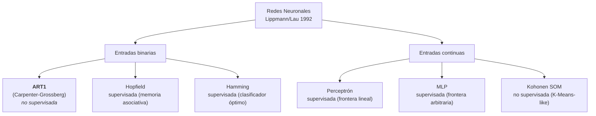

# 01 · Marco Teórico

## Red ART1 (Carpenter–Grossberg, 1987)

La red **ART1** (Adaptive Resonance Theory 1) fue propuesta por Gail Carpenter y Stephen Grossberg en 1987 [3] como una arquitectura autoorganizada capaz de formar **categorías (clusters) sin supervisión**. Este documento describe su origen, el problema que vino a resolver, su ubicación en la taxonomía de Lippmann/Lau y los detalles del algoritmo (Box 3 de Lau 1992).

> **Fuente primaria**: `_legacy/CarGross_TP/lau_contenido.md`, páginas 12–14, donde se transcribe el Box 3.
> **Referencia original**: Carpenter, G.A. & Grossberg, S. (1987). *A massively parallel architecture for a self-organizing neural pattern recognition machine*. Computer Vision, Graphics, and Image Processing, 37, 54–115.

*Nota: el material de referencia se preserva en `_legacy/CarGross_TP/` por valor histórico. Es el intento anterior del alumno que no se entregó; se cita aquí como antecedente conceptual.*

## 1. Origen y motivación

A mediados de los 80, las redes supervisadas (perceptrón, MLP) resolvían bien problemas en los que las clases estaban definidas de antemano. Faltaba una arquitectura para el caso opuesto: **cuando las clases no se conocen de antemano** y se busca descubrirlas a partir de los propios datos.

ART1 fue la respuesta. Es una red que **crea clusters incrementalmente**: cada nueva entrada se compara con los exemplares almacenados, y se crea un cluster nuevo sólo cuando ninguno de los existentes resulta "suficientemente similar" (criterio parametrizado por la vigilancia $\rho$).

## 2. El dilema estabilidad–plasticidad

Es el problema central que ART1 resuelve, formulado por Grossberg:

- **Plasticidad**: la red debe poder aprender patrones nuevos que no vio antes.
- **Estabilidad**: la red no debe borrar los patrones ya aprendidos cada vez que aparece información nueva.

ART1 lo equilibra mediante el parámetro de **vigilancia** $\rho \in [0, 1]$:

- $\rho$ alto: exige coincidencia casi exacta → muchos clusters nuevos (prioriza plasticidad).
- $\rho$ bajo: acepta coincidencias parciales → pocos clusters grandes (prioriza estabilidad).

El nombre "Adaptive Resonance" viene de la búsqueda de un estado de **resonancia** entre la entrada y el exemplar almacenado: cuando la hay, se aprende (plasticidad protegida por estabilidad); cuando no, se crea un cluster nuevo. Hasta entonces, ninguna arquitectura estándar resolvía este dilema sin compromisos duros.

## 3. Posición en la taxonomía de Lippmann/Lau

Lippmann (1987) y la transcripción de Lau (1992) proponen una taxonomía de redes neuronales útiles para clasificación de patrones, ordenadas por **tipo de entrada** y **régimen de entrenamiento**:

| Red | Entrada | Supervisión | Algoritmo clásico equivalente |
|-----|---------|-------------|-------------------------------|
| Hopfield | Binaria | No (asociativa) | Memoria asociativa (recuperación por contenido) |
| Hamming | Binaria | No (clasificador) | Clasificador óptimo de mínimo error |
| **ART1** (Carpenter–Grossberg) | **Binaria** | **No** | **Leader clustering** |
| Perceptrón | Continua o binaria | Sí | Clasificador lineal (hiperplano) |
| Perceptrón Multicapa (MLP) | Continua o binaria | Sí | Clasificador de frontera arbitraria |
| Kohonen (SOM) | Continua | No | K-Means clustering |

### Notas comparativas

- **vs Hopfield**: Hopfield almacena un conjunto *fijo* de patrones y recupera el más cercano a una entrada ruidosa. ART1 también recupera el más cercano, pero **puede crear memorias nuevas** cuando ninguna existente resuena lo suficiente. Hopfield además sufre de patrones espurios y de capacidad limitada (≈ 0.15·N patrones almacenables en la red, donde N es la dimensión).
- **vs Hamming**: Hamming compara la entrada con un conjunto *prefijado* de exemplares usando distancia de Hamming. ART1 usa una lógica muy similar (producto punto en lugar de Hamming, más el test de vigilancia), pero **puede añadir un nuevo exemplar** cuando el ratio de vigilancia falla.
- **vs Perceptrón / MLP**: ambos son supervisados y producen fronteras de decisión, no clusters. La pregunta que responden es distinta (¿a qué clase pertenece esto?), lo cual los hace no comparables directamente con ART1.
- **vs Kohonen (SOM)**: SOM también es no supervisado, pero **requiere fijar el número de clusters** de antemano y los organiza en un mapa topológicamente ordenado. ART1 descubre el número dinámicamente, sin topología preestablecida.

## 4. ¿Cuándo ART1 es buena elección?

ART1 conviene cuando se cumplen simultáneamente estas condiciones:

- **No hay etiquetas** disponibles (problema no supervisado).
- Los datos, o sus representaciones relevantes, son **binarios** o binarizables sin pérdida grave.
- Se quiere **descubrir el número de grupos** en lugar de fijarlo a priori.
- Se necesita entrenamiento **incremental** (se pueden agregar datos sin reentrenar).
- El orden de presentación tiene cierto grado de repetibilidad, o se acepta sensibilidad al orden (medida por ARI; ver `05_corridas_y_evaluacion.md`).

## 5. ¿Cuándo NO es apropiada?

- Datos intrínsecamente continuos donde la binarización perdería información crítica (usar ART2 o K-means en su lugar).
- Problemas que requieren generalización **supervisada** contra etiquetas verdaderas.
- Aplicaciones donde el orden de presentación varía mucho y se requiere estabilidad estricta entre corridas.
- Cuando se necesita evaluación contra ground-truth: ART1 no responde a accuracy/F1, es por naturaleza no supervisada.

## 6. Resumen del algoritmo (Box 3)

El algoritmo de ART1, tal como aparece en Lau 1992 pp. 12–14, ejecuta los siguientes pasos por cada nueva entrada $X = (x_0, \dots, x_{N-1})$ con $x_i \in \{0, 1\}$:

1. **Inicialización**: pesos top-down $t_{ij}(0) = 1$; pesos bottom-up $b_{ij}(0) = 1/(1+N)$. Se fija la vigilancia $\rho \in [0, 1]$.
2. **Presentar** la nueva entrada binaria $X$.
3. **Matching scores**: $\mu_j = \sum_i b_{ij}(t) \cdot x_i$ para cada nodo de salida $j$ activo.
4. **Mejor match** (MAXNET): $j^* = \arg\max_j \mu_j$, implementado con inhibición lateral.
5. **Test de vigilancia**: ¿$\|T \cdot X\| / \|X\| > \rho$?
6. **Si NO**: deshabilitar $j^*$ y volver al Step 3 con el resto de candidatos.
7. **Si SÍ**: adaptar el exemplar: $t_{ij^*}(t+1) = t_{ij^*}(t) \cdot x_i$ (AND lógico), y renormalizar $b_{ij^*}(t+1)$.
8. **Repetir** desde Step 2 con la siguiente entrada, rehabilitando los nodos deshabilitados.

El detalle matemático y su traducción a pseudocódigo Python están en `04_algoritmo.md`.

## 7. Referencias del marco teórico

- Carpenter, G.A. & Grossberg, S. (1987). *A massively parallel architecture for a self-organizing neural pattern recognition machine*. CVGIP 37:54–115.
- Grossberg, S. (1976). *Adaptive pattern classification and universal recoding*. Biological Cybernetics, 23:121–134.
- Lippmann, R.P. (1987). *An introduction to computing with neural nets*. IEEE ASSP Magazine, April 1987.
- Lau, C. (Ed.) (1992). *Artificial Neural Networks*. IEEE Press. (transcripción en `_legacy/CarGross_TP/lau_contenido.md`)
- Hartigan, J.A. (1975). *Clustering Algorithms*. Wiley. (origen del "leader algorithm")
