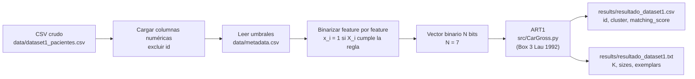

# 03 · Dataset y Preprocesamiento

## Datasets canónicos

Para este TFI se adoptan dos datasets, ambos satisfaciendo el mínimo de la consigna (≥ 50 filas × ≥ 5 variables):

| Dataset | Dominio | Filas | Columnas | Ubicación |
|---------|---------|-------|----------|-----------|
| `dataset1_pacientes.csv` | Clínico simulado (riesgo cardiovascular y metabólico) | 55 | 8 (1 id + 7 features) | `data/dataset1_pacientes.csv` |
| `dataset2_sensores.csv` | Industrial simulado (monitoreo de máquinas) | 55 | 8 (1 id + 7 features) | `data/dataset2_sensores.csv` |

Ambas columnas de identificación (`id`, `sensor_id`) son **identificadores opacos** para el algoritmo: no se binarizan ni participan del clustering, sólo sirven para mapear filas ↔ cluster ↔ interpretación en la salida.

## 1. Requisito de binarización

ART1 toma entradas **estrictamente binarias** ($x_i \in \{0, 1\}$). Lau (1992, p. 12) lo explicita:

> *"los elementos tanto de las entradas como de los exemplares almacenados toman solo los valores 0 y 1"*

Como los datasets son continuos, se aplica una **función umbral por feature**, codificada en `data/metadata.csv`. La elección de los umbrales no es arbitraria: cada feature usa un valor clínico u operativo estándar (guías AHA/ADA/OMS para clínicas; ISO 10816 o prácticas operativas para industriales). Esto hace que la binarización sea defendible y reproducible.

## 2. Umbrales de binarización — Dataset 1 (Pacientes)

Se aplica la regla "$X \geq$ umbral $\Rightarrow 1$" salvo donde se indique lo contrario.

| Feature | Umbral | Unidad | Justificación |
|---------|--------|--------|---------------|
| `edad` | 40 | años | A partir de mediana adultez se intensifica el cribado cardiovascular (USPSTF). |
| `presion_sistolica` | 140 | mmHg | Umbral de hipertensión grado 1 (AHA 2017). |
| `presion_diastolica` | 90 | mmHg | Umbral de hipertensión grado 1 (AHA 2017). |
| `colesterol` | 240 | mg/dL | Umbral de colesterol alto (ATP III). |
| `glucosa` | 110 | mg/dL | Glucosa alterada en ayunas (ADA). ≥ 126 mg/dL ya sería diabetes; 110 captura el estado prediabético. |
| `imc` | 30 | kg/m² | Umbral de obesidad (OMS). |
| `frecuencia_cardiaca` | 85 | lpm | Taquicardia en reposo (criterio clínico habitual; >100 lpm es patológico, 85 marca valores elevados). |

Cada feature se mapea a 1 bit, produciendo un **vector binario de 7 dimensiones** por paciente.

## 3. Umbrales de binarización — Dataset 2 (Sensores)

| Feature | Umbral | Unidad | Justificación |
|---------|--------|--------|---------------|
| `temperatura` | 75 | °C | Alerta operativa por encima del rango nominal de la máquina. |
| `vibracion` | 0.20 | mm/s | Umbral ISO 10816 para máquinas críticas (zona B/C). |
| `presion` | 103 | bar | Alto operativo (10 % por encima del nominal 100 bar). |
| `voltaje` | rango 218–220 | V | Codificación como **fuera del rango nominal** ($\notin [218, 220] \Rightarrow 1$). El nominal es 220 V con tolerancia asimétrica. |
| `corriente` | 20 | A | Alto operativo. |
| `rpm` | 1450 | rpm | Cercanía al límite superior operativo de la máquina (nominal 1500 rpm). |
| `tiempo_operacion` | 3000 | horas | Umbral típico de mantenimiento preventivo. |

Cada feature se mapea a 1 bit, produciendo un **vector binario de 7 dimensiones** por sensor.

## 4. Formato del archivo de metadatos

Los umbrales viven en `data/metadata.csv` con el siguiente formato (una fila por feature). Se extiende con dos campos menores respecto a la consigna estricta: una columna `dataset` (para soportar múltiples datasets en un único archivo) y una columna `rule` (para soportar binarizaciones no-estándar como la ventana de `voltaje`).

```csv
dataset,feature,threshold,unit,rule,justification
dataset1_pacientes,edad,40,años,ge,Mediana adultez - cribado cardiovascular USPSTF
dataset1_pacientes,presion_sistolica,140,mmHg,ge,Hipertensión grado 1 (AHA 2017)
...
dataset2_sensores,voltaje,218-220,V,out_of_range,Fuera del rango nominal [218 220] V ⇒ 1
...
```

Valores posibles de `rule`:

- `ge` (default): $X_i \geq \text{threshold} \Rightarrow 1$
- `gt`: $X_i > \text{threshold} \Rightarrow 1$
- `lt`: $X_i < \text{threshold} \Rightarrow 1$
- `out_of_range`: $\text{threshold}$ es un par `low-high`; $X_i \notin [\text{low}, \text{high}] \Rightarrow 1$

Este archivo es consumido por `src/CarGross.py` durante la fase de preprocesamiento, de modo que modificar umbrales **no requiere tocar código**.

## 5. Diagrama de flujo de datos



## 6. Pérdida de información

La binarización **tiene un costo**: dos pacientes con glucosa 109 y 111 mg/dL caen en categorías distintas, mientras que dos pacientes con 90 y 109 mg/dL quedan en la misma. Esto se compensa parcialmente con la simplicidad del modelo y la interpretabilidad clínica de los umbrales, pero debe quedar documentado como una limitación real (ver `06_limitaciones_y_etica.md`).

Una alternativa sería ART2 (entradas continuas con la misma arquitectura general), pero está fuera de la consigna de este TFI.

## 7. Split train/test — no aplica

ART1 es **no supervisado** y se entrena con **todas** las filas del dataset. No se aplica split train/test ni se reservan filas para evaluación contra ground-truth, dado que no hay etiquetas verdaderas. La validación de calidad se hace con las métricas no supervisadas definidas en `05_corridas_y_evaluacion.md` (estabilidad entre corridas, compactness, interpretabilidad cualitativa).

## 8. Referencias de los umbrales

- Whelton, P.K. et al. (2018). *2017 ACC/AHA Guideline for High Blood Pressure in Adults*. JACC.
- Grundy, S.M. et al. (2004). *Implications of Recent Clinical Trials for the National Cholesterol Education Program Adult Treatment Panel III Guidelines*. Circulation.
- American Diabetes Association. *Standards of Care in Diabetes — 2024*. Diabetes Care 47(Suppl 1).
- WHO. *BMI Classification*. (https://www.who.int/news-room/fact-sheets/detail/obesity-and-overweight)
- ISO 10816-3:2009. *Mechanical vibration — Measurement and evaluation of machine vibration — Part 3: Industrial machinery*.
