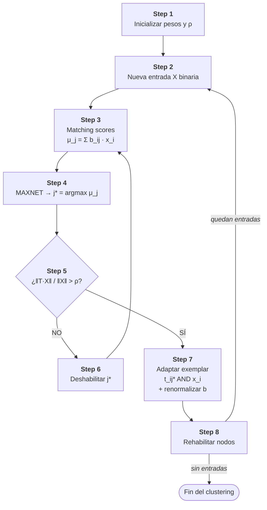

# 04 · Algoritmo

## ART1 paso a paso (Box 3, Lau 1992 pp. 12–14)

Este documento transcribe y comenta el **algoritmo de clustering secuencial** que ART1 implementa según Lau 1992. Es el mismo flujo que debe implementar `src/CarGross.py`.

Las variables y constantes se mantienen iguales a las del paper para facilitar la lectura cruzada con `_legacy/CarGross_TP/lau_contenido.md`. Se asume **fast learning**: los pesos convergen en una sola presentación por entrada.

*Nota: el material de referencia se preserva en `_legacy/CarGross_TP/` por valor histórico. Es el intento anterior del alumno que no se entregó; se cita aquí como antecedente conceptual.*

## 1. Notación

| Símbolo | Significado |
|---------|-------------|
| $N$ | Dimensión de la entrada (cantidad de bits por fila binarizada). |
| $M$ | Cantidad máxima posible de nodos de salida (clusters). |
| $X = (x_0, \dots, x_{N-1})$ | Entrada binaria, $x_i \in \{0, 1\}$. |
| $t_{ij}$ | Peso **top-down** del nodo de entrada $i$ al nodo de salida $j$. Define el exemplar del cluster $j$. |
| $b_{ij}$ | Peso **bottom-up** del nodo de entrada $i$ al nodo de salida $j$. |
| $\mu_j$ | Puntaje de coincidencia del nodo $j$ frente a la entrada actual. |
| $j^*$ | Nodo ganador (máximo $\mu_j$). |
| $\rho$ | Parámetro de vigilancia, $\rho \in [0, 1]$. |
| $\|X\|$ | Número de bits en 1 en $X$ (norma $L_1$): $\sum_i x_i$. |
| $\|T \cdot X\|$ | Bits en común entre el exemplar $T$ y la entrada $X$: $\sum_i t_{ij}\, x_i$. |

## 2. Paso a paso

### Step 1 — Inicialización

$$
t_{ij}(0) = 1, \qquad b_{ij}(0) = \frac{1}{1 + N}, \qquad \forall \, i, j
$$

Se fija el umbral de vigilancia $\rho \in [0, 1]$.

**Qué hace**: pone todos los pesos top-down en 1 y los bottom-up iguales a $1/(1+N)$. Es una inicialización que representa "ningún exemplar aprendido todavía": todos los nodos arrancan en el mismo estado.

**Por qué importa**: garantiza que las primeras entradas compitan en igualdad de condiciones. Sin esta simetría, el primer exemplar se vería sesgado por la inicialización aleatoria.

### Step 2 — Aplicar nueva entrada

Presentar $X = (x_0, \dots, x_{N-1})$ con $x_i \in \{0, 1\}$.

**Qué hace**: carga la próxima fila binarizada en el estrato de entrada.

### Step 3 — Matching scores

$$
\mu_j = \sum_{i=0}^{N-1} b_{ij}(t)\, x_i, \qquad \forall \, j \in \{j \text{ activos}\}
$$

**Qué mide**: una **similitud** entre la entrada y el exemplar del cluster $j$. Sólo se calculan para los nodos **no deshabilitados** en esta iteración (ver Step 6). Inicialmente todos lo están.

### Step 4 — Selección del mejor match (MAXNET)

$$
\mu_{j^*} = \max_j \mu_j
$$

Se implementa típicamente con una **subred MAXNET** de inhibición lateral: los nodos competidores se suprimen mutuamente hasta que sólo uno queda activo. Es la misma técnica usada en la red de Hamming (Lau 1992 pp. 8–10).

**Por qué importa**: ART1 procesa un patrón por vez. Si dos clusters empataran en similitud, el MAXNET define cuál gana — y los empates múltiples se evitan en buena medida por la renormalización de $b_{ij}$ en Step 7.

### Step 5 — Test de vigilancia

$$
\|X\| = \sum_{i=0}^{N-1} x_i, \qquad \|T \cdot X\| = \sum_{i=0}^{N-1} t_{ij^*}\, x_i
$$

$$
\text{¿}\frac{\|T \cdot X\|}{\|X\|} > \rho\text{?}
$$

- **SÍ** → ir a Step 7.
- **NO** → ir a Step 6.

**Qué mide el ratio**: la **proporción de bits en común** entre la entrada y el exemplar, normalizada por el número de bits encendidos de la entrada. Si la entrada tiene pocos bits en 1 pero casi todos están en el exemplar, el ratio puede ser alto.

- $\rho$ cercano a 1 exige coincidencia casi exacta.
- $\rho$ cercano a 0 acepta cualquier solapamiento mínimo.

### Step 6 — Deshabilitar $j^*$ y volver a Step 3

$$
\mu_{j^*} \leftarrow 0 \quad \text{(temporalmente)}
$$

El nodo ganador actual queda fuera de la maximización del Step 3 y se vuelve a competir entre los restantes. Si todos los candidatos activos son rechazados por vigilancia, eventualmente se **crea un nuevo nodo** cuyo exemplar es $X$ mismo, inicializando los pesos de forma consistente con Step 7.

### Step 7 — Adaptar el exemplar ganador

$$
t_{ij^*}(t+1) = t_{ij^*}(t) \cdot x_i \quad \text{(AND lógico bit a bit)}
$$

$$
b_{ij^*}(t+1) = \frac{t_{ij^*}(t) \cdot x_i}{0.5 + \sum_{i=0}^{N-1} t_{ij^*}(t) \cdot x_i}
$$

**Qué hace**: el nuevo exemplar es la **intersección** (AND bit a bit) entre el antiguo y la entrada. La renormalización de $b_{ij}$ mantiene estable la probabilidad de resonancia frente a la reducción de $\|T\|$.

**Por qué importa**: el AND garantiza que el exemplar **nunca crece** — sólo se reduce o se mantiene. Frente a entradas ruidosas el exemplar se va "evaporando" hacia cero, lo cual es la firma del problema conocido de ART1 con ruido (Lau 1992 p. 13, Fig. 11). En este TFI se acepta ese comportamiento como propio del modelo.

### Step 8 — Repetir

Rehabilitar los nodos deshabilitados en Step 6 y volver al Step 2 con la próxima entrada.

## 3. Diagrama de flujo del algoritmo

## 4. Parámetros operativos

| Parámetro | Rango | Default | Significado |
|-----------|-------|---------|-------------|
| $\rho$ (vigilancia) | $[0, 1]$ | según experimento | Similitud mínima para aceptar un match. |
| `max_clusters` | $\mathbb{Z}^+$ | $N_{\text{filas}}$ | Cantidad máxima de nodos de salida disponibles. |
| orden de entrada | permutación | natural | ART1 es **sensible al orden**; las corridas en `05_corridas_y_evaluacion.md` barajan y comparan (ARI). |

## 5. Observaciones formales

- **Crecimiento dinámico**: cada nuevo cluster consume 1 nodo y $2N$ conexiones adicionales.
- **Exemplares decrecientes**: el AND sucesivo (Step 7) puede llevar a un exemplar vacío si las entradas son ruidosas; en ese caso el cluster queda inutilizable para el futuro (la condición de vigilancia fallaría sistemáticamente).
- **Sin patrón espurio**: a diferencia de Hopfield, ART1 no genera respuestas ficticias. Todo exemplar proviene de una entrada efectivamente presentada.
- **Estabilidad garantizada por la dinámica**: las ecuaciones diferenciales nolineales subyacentes tienen estabilidad demostrada (Lau 1992 p. 12), aunque la versión discreta del Box 3 puede exhibir cierta sensibilidad al orden.

## 6. Referencia de implementación

El algoritmo descripto arriba se implementa en `src/CarGross.py` (en raíz del proyecto). La versión previa de referencia (419 líneas, completa y testeada) está en `_legacy/CarGross_TP/src/CarGross.py` y puede consultarse con fines comparativos; **no se modifica** en este TFI.
