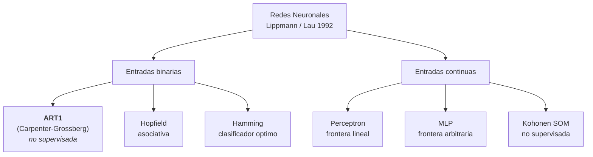
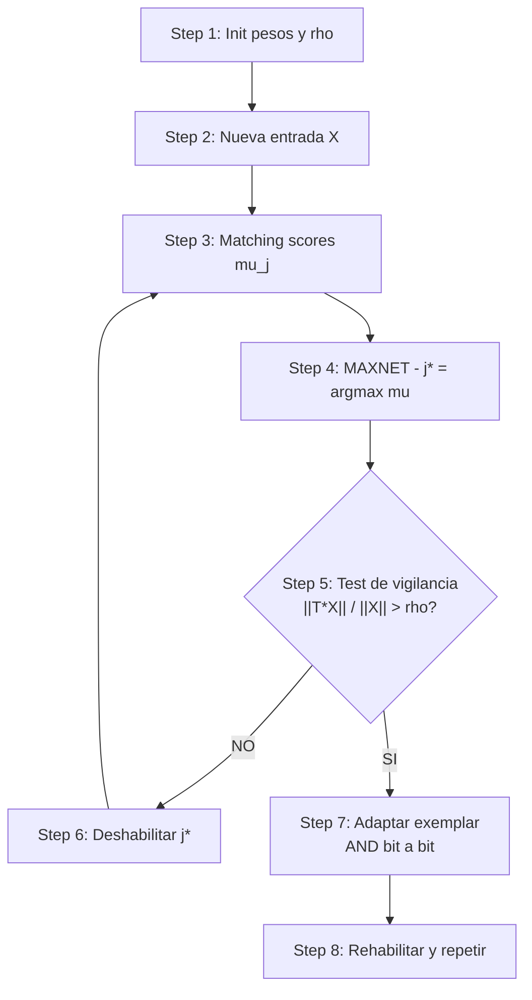

# Outline para PPT — Redes de Carpenter-Grossberg (ART1)

## TFI de Redes Neuronales — UADER / IDTI Lab

> Documento de soporte para armar la presentación. **NO** es la presentación en sí. Contiene la estructura de slides, los bullets principales y las notas del orador (lo que se debe decir en el audio).
>
> **Consigna oficial** (`_legacy/CarGross_TP/consignas_TP.md`, Actividad obligatoria #2): PPT con audio que explique origen, justificación y características de las redes de Carpenter-Grossberg; aplicaciones; fortalezas y debilidades; diferencia clara con otras redes de interés. **Se califica la originalidad y la didáctica.**
>
> Tiempo total sugerido: **8-12 minutos** (la consigna pide audio; no fija duración).

## Índice de slides

| # | Slide | Propósito didáctico | Duración estimada |
|---|-------|---------------------|--------------------|
| 1 | Portada | Identificar el trabajo, el equipo y la institución. | 30 s |
| 2 | Contexto: ¿qué es una red neuronal artificial? | Anclar al oyente antes de hablar de ART1. | 45 s |
| 3 | Taxonomía de Lippmann (1987) / Lau (1992) | Ubicar ART1 dentro del mapa de redes clásicas. | 60 s |
| 4 | El dilema estabilidad–plasticidad | Plantear el problema que ART1 viene a resolver. | 60 s |
| 5 | ¿Qué es ART1? Algoritmo de Carpenter–Grossberg | Definición y mecánica general. | 60 s |
| 6 | El algoritmo: Box 3 de Lau 1992 (Steps 1-8) | Las cuentas que hace la red, paso a paso. | 90 s |
| 7 | Aplicaciones reales y potenciales | Donde se usa y donde podría usarse. | 60 s |
| 8 | Fortalezas de ART1 | Lo que la red hace bien. | 45 s |
| 9 | Debilidades y limitaciones | Lo que la red hace mal o no hace. | 45 s |
| 10 | Diferencias con otras redes (tabla comparativa) | Hopfield, Hamming, Perceptrón, MLP, Kohonen. | 75 s |
| 11 | Implementación en este TFI | Qué corrimos, qué obtuvimos, con qué datasets. | 90 s |
| 12 | Conclusiones y trabajo futuro | Cierre conceptual y líneas que quedan abiertas. | 45 s |
| 13 | Preguntas y bibliografía | Créditos y espacio para consultas. | 15 s |

**Total estimado**: ~10 minutos, dentro del rango 8-12 min.

---

## Slide 1 — Portada

- **Título**: "Redes de Carpenter-Grossberg (ART1): clustering no supervisado para datos tabulares"
- **Subtítulo**: "Trabajo Final Integrador — Materia Redes Neuronales"
- **Integrantes**: Escar Camilo, Gonzalez Claudio, Laballeja Sofia, Meriano Patricia
- **Docente**: [completar]
- **Institución**: UADER — Facultad de Ingeniería — IDTI Lab
- **Fecha**: [completar]
- **Logos**: UADER + IDTI Lab (esquina superior, opcional pero ayuda a la identidad visual)

**Notas del orador (audio, ~30 s)**:
> "Hola, somos [nombres] y en los próximos [8-12] minutos vamos a contarles qué son las redes de Carpenter-Grossberg — conocidas como ART1 — y por qué nos parecieron la pieza más interesante de la taxonomía clásica de redes neuronales. Vamos a recorrer su origen, la matemática del algoritmo, dónde se usan, qué hacen bien, qué hacen mal, y cómo se diferencian de otras redes que probablemente ya conocen, como Hopfield, Hamming, el perceptrón o Kohonen. Al final mostramos qué implementamos nosotros en este trabajo y qué obtuvimos. Adelante."

---

## Slide 2 — Contexto: ¿qué es una red neuronal artificial?

- Una RNA es un modelo computacional **inspirado** (no copiado) en la organización de neuronas biológicas: unidades simples conectadas que se excitan o se inhiben entre sí.
- Aprende **a partir de datos**, no de reglas escritas a mano. Los pesos sinápticos se ajustan por un algoritmo de entrenamiento.
- Existen tres regímenes: **supervisado** (hay etiquetas, la red aprende a predecirlas), **no supervisado** (no hay etiquetas, la red descubre estructura) y **por refuerzo** (la red recibe señales de acierto/error dispersas).
- Las redes neuronales **clásicas** (las de este TFI) son anteriores al deep learning: tienen una o dos capas, parámetros pequeños y se estudian por su claridad pedagógica y por haber resuelto problemas puntuales con elegancia.

**Notas del orador (audio, ~45 s)**:
> "Antes de meternos con Carpenter y Grossberg, vamos a poner en contexto qué es una red neuronal artificial. La idea básica es simple: muchas unidades de cálculo chicas, conectadas entre sí, que se pasan señales. Cada conexión tiene un peso — un número que indica cuánto pesa esa señal — y la red ajusta esos pesos para resolver una tarea. Lo que cambia entre modelos es justamente qué tarea resuelven, cómo se ajustan los pesos y de qué tipo son las entradas. En este TFI vamos a hablar de un tipo particular: una red que trabaja sin etiquetas, sin que nadie le diga la respuesta, y que se encarga sola de encontrar grupos en los datos."

---

## Slide 3 — Posición en la taxonomía de Lippmann (1987) / Lau (1992)

- Lippmann (1987) y la transcripción de Lau (1992) ordenan las redes neuronales clásicas por **tipo de entrada** (binaria vs continua) y **régimen de entrenamiento** (supervisado vs no supervisado).
- **Binarias + no supervisado** = **ART1** (Carpenter–Grossberg) y, en parte, Kohonen (que admite binarias pero suele presentarse con continuas).
- **Binarias + supervisado (asociativo)** = Hopfield (memoria asociativa) y Hamming (clasificador por distancia mínima).
- **Continuas + supervisado** = Perceptrón (frontera lineal) y MLP (frontera arbitraria).
- **Continuas + no supervisado** = Kohonen SOM (K-Means-like, con mapa topológico).

Diagrama sugerido (Mermaid — copiar a mermaid.live):

**Notas del orador (audio, ~60 s)**:
> "Para no hablar de ART1 en el vacío, ubicamos la red en el mapa clásico que armaron Lippmann en 1987 y que Lau transcribió en 1992. La taxonomía ordena las redes en dos ejes: el tipo de entrada — binaria o continua — y el régimen de entrenamiento — supervisado o no supervisado. ART1 cae en la celda de entradas binarias y entrenamiento no supervisado, junto con un primo lejano que es Kohonen. En la celda de binarias supervisadas están Hopfield y Hamming, dos redes que también vamos a mencionar para comparar. Y en la celda de entradas continuas están el perceptrón, el perceptrón multicapa y Kohonen. Tener este mapa en la cabeza ayuda a entender qué pregunta viene a responder cada red — y por qué ART1 no compite con un MLP, sino que hace otra cosa."

---

## Slide 4 — El dilema estabilidad–plasticidad

- Formulado por Grossberg (1976): ¿cómo hace una red para **seguir aprendiendo patrones nuevos** sin **borrar los que ya aprendió**?
- **Plasticidad** = la red debe poder incorporar información nueva (entradas nunca vistas).
- **Estabilidad** = la red debe conservar lo ya aprendido cuando aparecen nuevas entradas.
- Las redes puramente plásticas (Hebbian puro) sobreescriben todo; las puramente estables (memoria fija) no aprenden nunca.
- ART1 resuelve el dilema con un **parámetro de vigilancia** $\rho$: si una entrada "resuena" lo suficiente con un exemplar existente, se absorbe; si no, se crea un cluster nuevo. Nada se pisa.

| $\rho$ alto | $\rho$ bajo |
|--------------|-------------|
| Exige coincidencia casi exacta | Acepta coincidencias parciales |
| Crea muchos clusters nuevos | Mantiene pocos clusters grandes |
| Prioriza **plasticidad** | Prioriza **estabilidad** |

**Notas del orador (audio, ~60 s)**:
> "Antes de ART1 había un problema abierto, que Grossberg mismo llamó el dilema estabilidad-plasticidad. La pregunta es: ¿cómo hace una red para seguir aprendiendo cosas nuevas sin tirar a la basura lo que ya aprendió? Si la red es muy plástica, sobreescribe todo el tiempo; si es muy estable, se congela y no aprende nada nuevo. ART1 resuelve este dilema con una idea elegante: cuando llega un patrón nuevo, la red lo compara con los exemplares que ya tiene guardados; si el parecido pasa un umbral — que llamamos parámetro de vigilancia, rho — lo incorpora al cluster existente; si no, crea un cluster nuevo. Así no se pierde lo viejo y se suma lo nuevo. La vigilancia es el dial que nos permite decidir qué tan estricta es la red: vigilancia alta exige coincidencias casi exactas y crea muchos clusters chicos; vigilancia baja acepta parecidos parciales y mantiene pocos clusters grandes. Esa es la palanca central de ART1 y la vamos a ver en acción cuando mostremos los resultados."

---

## Slide 5 — ¿Qué es ART1? Algoritmo de Carpenter-Grossberg

- ART1 = **Adaptive Resonance Theory 1**. Propuesta por Gail Carpenter y Stephen Grossberg en 1987 (CVGIP 37:54–115).
- Es una arquitectura **no supervisada** para **entradas binarias** que **crea clusters incrementalmente**: cada nueva entrada se compara con los exemplares almacenados.
- La red tiene **dos capas** totalmente conectadas: la capa de entrada $F_1$ (recibe el vector) y la capa de salida $F_2$ (los clusters). Hay **pesos en ambas direcciones** (top-down y bottom-up).
- El "resonance" del nombre se refiere al estado en que la entrada y el exemplar **se activan mutuamente** de forma estable — es la firma de que la entrada fue asignada al cluster correcto.
- Es, en esencia, una versión elegante y online del **leader clustering** (Hartigan, 1975): la primera entrada crea el primer cluster; las siguientes o se anexan o fundan uno nuevo.

**Notas del orador (audio, ~60 s)**:
> "ART1 quiere decir Adaptive Resonance Theory 1, y fue publicada por Gail Carpenter y Stephen Grossberg en 1987. Es una red no supervisada — no necesita etiquetas — y trabaja con entradas binarias: vectores de ceros y unos. Lo que hace es, básicamente, agrupar las entradas en clusters. Cada cluster tiene un exemplar, que es el patrón representativo del grupo. Cuando llega un vector nuevo, la red lo compara con todos los exemplares y decide: o se parece lo suficiente a uno existente y se suma a ese cluster, o no se parece a ninguno y se crea un cluster nuevo con ese vector como primer miembro. La red tiene dos capas totalmente conectadas con pesos en ambas direcciones, y eso es importante porque le permite comparar de ida y de vuelta. El nombre 'adaptive resonance' viene del estado en que la entrada y el exemplar se activan mutuamente de manera estable — eso es la resonancia, y es la señal de que la asignación fue correcta. Conceptualmente, ART1 es una versión elegante y online del leader clustering clásico, el algoritmo donde el primer patrón que aparece manda."

---

## Slide 6 — El algoritmo: Box 3 de Lau 1992 (Steps 1-8)

Para cada entrada binaria $X$ con $N$ bits:

1. **Inicialización**: pesos top-down $t_{ij}(0) = 1$; pesos bottom-up $b_{ij}(0) = 1/(1+N)$. Vigilancia $\rho$ fija.
2. **Presentar** la nueva entrada $X$ en la capa $F_1$.
3. **Matching scores**: $\mu_j = \sum_i b_{ij}\, x_i$ para cada nodo de salida activo.
4. **Mejor match** (subred MAXNET, inhibición lateral): $j^* = \arg\max_j \mu_j$.
5. **Test de vigilancia**: ¿$\frac{\|T \cdot X\|}{\|X\|} > \rho$?
6. **Si NO** → deshabilitar $j^*$ y volver al Step 3 con los candidatos restantes.
7. **Si SÍ** → **adaptar** el exemplar: $t_{ij^*}(t+1) = t_{ij^*}(t) \cdot x_i$ (AND bit a bit) y renormalizar $b_{ij^*}$.
8. **Repetir** desde Step 2 con la próxima entrada, rehabilitando nodos.

Diagrama de flujo sugerido (Mermaid):

**Notas del orador (audio, ~90 s)**:
> "Esta es la parte más densa de la PPT, pero también la más importante. El algoritmo de ART1 tiene ocho pasos y los transcribimos textualmente del Box 3 del paper de Lau de 1992, que es la fuente que usamos como referencia primaria. Primero se inicializan los pesos: los pesos que van de la entrada hacia los clusters arrancan en uno; los pesos que van de los clusters hacia la entrada arrancan en una constante chiquita que depende de la dimensión de la entrada. Después, para cada vector nuevo, se calcula un puntaje de coincidencia con cada cluster existente — un producto punto entre los pesos y la entrada. Se elige el ganador con una subred de inhibición lateral — MAXNET — que es la misma técnica que usa la red de Hamming. Y acá viene la decisión clave: se compara la fracción de bits en común entre la entrada y el exemplar del cluster ganador contra el umbral de vigilancia. Si pasa el umbral, se actualiza el exemplar haciéndole un AND bit a bit con la entrada — la intersección lógica. Si no pasa, se deshabilita ese candidato y se vuelve a probar con el siguiente. Cuando se acaban los candidatos, se crea un cluster nuevo. Ese ciclo se repite para cada entrada, una por una. Es online: cada nueva entrada puede reclasificar lo anterior."

---

## Slide 7 — Aplicaciones reales y potenciales

**Donde ART1 (y sus variantes ART2/ARTMAP) se usan o se han usado**:

- **Reconocimiento de patrones** sobre datos binarios o categóricos: clasificación de caracteres impresos, firmas, huellas dactilares.
- **Detección de anomalías** en señales industriales: una lectura que no resuena con ningún cluster existente es, por definición, atípica.
- **Diagnóstico médico exploratorio** (con disclaimer): clustering de pacientes por perfiles de riesgo a partir de variables clínicas binarizadas.
- **Mantenimiento predictivo**: clustering de regímenes operativos de una máquina (nominal, alerta, falla) a partir de lecturas de sensores binarizadas.
- **Monitoreo en tiempo real**: como ART1 es online, puede seguir aprendiendo a medida que llegan datos nuevos sin reentrenar.

**Variantes de la familia ART**:

- **ART2**: entradas continuas (sin binarizar).
- **ARTMAP**: dos módulos ART1 enlazados por un mapa asociativo, aprendizaje supervisado.
- **Fuzzy ART**: combina ART con lógica fuzzy, acepta entradas en $[0, 1]$.

**Notas del orador (audio, ~60 s)**:
> "¿Y esto se usa? Sí, en problemas donde los datos son naturalmente binarios o se pueden binarizar sin perder lo esencial. Los casos clásicos son reconocimiento de caracteres — las imágenes se binarizan y se agrupan por estilo de trazo —, detección de anomalías en señales de sensores — si una lectura no resuena con ningún cluster conocido, es candidata a ser una anomalía —, y diagnóstico médico exploratorio, que es justamente lo que abordamos nosotros en este trabajo, con todos los disclaimers del caso. ART1 también es atractiva para mantenimiento predictivo y monitoreo en tiempo real, porque procesa las entradas de a una y puede ir aprendiendo sobre la marcha. La familia ART no termina en ART1: existen variantes como ART2 para entradas continuas, ARTMAP para problemas supervisados con dos módulos ART enlazados, y Fuzzy ART que acepta valores entre cero y uno en lugar de bits puros."

---

## Slide 8 — Fortalezas de ART1

- **No supervisada**: no requiere etiquetas. Útil cuando no se tiene ground-truth o el costo de etiquetar es prohibitivo.
- **Aprendizaje incremental y online**: cada nueva entrada puede reclasificar lo anterior, pero nada se borra. No hay que reentrenar desde cero.
- **Estabilidad garantizada** por la dinámica subyacente: las ecuaciones diferenciales de Grossberg tienen estabilidad demostrada; los pesos solo decrecen (AND), nunca crecen.
- **Número de clusters dinámico**: a diferencia de K-means, no hay que fijar K a priori. La red lo descubre a medida que los datos lo exigen.
- **Exemplares interpretables**: cada cluster queda representado por un vector binario — el AND acumulado de todas sus entradas. Es **legible** por un humano, no una caja negra.
- **Sin patrones espurios**: a diferencia de Hopfield, no genera memorias falsas. Todo exemplar proviene de una entrada efectivamente presentada.
- **Determinista** dado un orden de entrada: mismos datos, mismo orden, mismos clusters. Facilita la reproducibilidad.

**Notas del orador (audio, ~45 s)**:
> "Las fortalezas de ART1 son varias y vale la pena resaltarlas. Primero, no necesita etiquetas: es ideal cuando no las hay o conseguirlas es caro. Segundo, aprende de manera incremental: cada nueva entrada puede reclasificar lo anterior, pero sin borrar lo que ya estaba. Tercero, el número de clusters no se fija a priori — la red lo descubre sola, que es justamente lo que diferencia a ART1 de K-means. Cuarto, los exemplares son vectores binarios legibles: cualquier persona puede mirar el representante del cluster y entender qué patrón lo define. Quinto, no genera memorias espurias como Hopfield: cada exemplar corresponde a una entrada real. Y sexto, es determinista: mismos datos, mismo orden, mismo resultado. Esto facilita reproducir los experimentos."

---

## Slide 9 — Debilidades y limitaciones

- **Solo entradas binarias**: variables continuas requieren binarización previa, que implica pérdida de información (dos valores muy cercanos caen en el mismo bit).
- **Sensibilidad al orden de presentación**: en regiones ambiguas, cambiar el orden de entrada puede reasignar filas entre clusters. La cantidad de clusters es estable, las asignaciones individuales no.
- **Exemplares que se "evaporan"**: el AND sucesivo (Step 7) puede llevar a un exemplar completamente en cero si las entradas son ruidosas. El cluster queda inutilizable.
- **Sin criterio formal para elegir $\rho$**: el experimentador debe probar varios valores y evaluar a ojo. No hay una fórmula cerrada.
- **Sin métrica nativa de evaluación**: como no hay etiquetas, no se puede hablar de accuracy o F1. La evaluación es por inspección de exemplares, compactness interna y, opcionalmente, ARI cuando se cuenta con ground-truth.
- **Capacidad acotada por $M$**: la red asigna como máximo $M$ clusters (típicamente $M = N$, la cantidad de filas). No escala a millones de categorías.
- **No es invariante a transformaciones triviales**: una permutación de features cambia el comportamiento de la red porque los pesos están atados a posiciones específicas de bits.

**Notas del orador (audio, ~45 s)**:
> "Como todo modelo, ART1 tiene sus limitaciones y es honesto mencionarlas. La primera es la más importante: solo trabaja con entradas binarias, así que si los datos son continuos hay que binarizarlos, y eso implica pérdida de información. Segundo, es sensible al orden de presentación: si las primeras entradas son atípicas, pueden crear clusters espurios que después sesgan todo. Tercero, los exemplares pueden evaporarse: como se actualizan con un AND lógico, ante ruido excesivo pueden quedar vacíos. Cuarto, no hay una receta cerrada para elegir el parámetro de vigilancia rho: hay que probar y mirar. Quinto, al ser no supervisada, no tiene accuracy ni F1; la evaluación es cualitativa o mediante métricas no supervisadas como compactness. Y sexto, la cantidad de clusters que puede crear está limitada por la cantidad de nodos de salida que se asignen al inicio. Estas limitaciones no invalidan el modelo, pero sí obligan a usarlo con cuidado."

---

## Slide 10 — Diferencias con otras redes (tabla comparativa)

| Red | Entrada | Supervisión | Qué hace | Diferencia clave con ART1 |
|------|---------|-------------|-----------|----------------------------|
| **ART1** (Carpenter–Grossberg) | Binaria | No | Clustering secuencial, $K$ dinámico | — |
| Hopfield | Binaria | No (asociativa) | Recupera el patrón almacenado más cercano a una entrada ruidosa | Hopfield tiene **K fijo** y sufre patrones espurios; ART1 **crea** clusters cuando hace falta |
| Hamming | Binaria | No (clasificadora) | Compara contra exemplares prefijados con distancia de Hamming | Hamming **no crea** clases nuevas; ART1 **sí** (test de vigilancia) |
| Perceptrón | Continua o binaria | Sí | Hiperplano de decisión | Resuelve otra pregunta: "¿a qué clase conocida pertenece esto?" |
| MLP | Continua o binaria | Sí | Frontera arbitraria | Misma pregunta que el perceptrón, con más potencia expresiva |
| Kohonen (SOM) | Continua | No | K-Means con mapa topológico | Kohonen **fija K** y organiza los clusters en un mapa ordenado; ART1 no asume topología |

**Notas del orador (audio, ~75 s)**:
> "Esta es la tabla que más nos pidió la consigna: la comparación con otras redes. Empecemos por las del mismo cuadrante — entradas binarias. Hopfield es una memoria asociativa: almacena un conjunto fijo de patrones y, cuando le llega una entrada ruidosa, recupera el más parecido. El problema es que no aprende patrones nuevos y, además, genera memorias espurias si se le cargan demasiados. ART1 hace lo mismo en espíritu — comparar y quedarse con el más parecido — pero además puede crear un cluster nuevo cuando ninguno resuena lo suficiente. Hamming es parecida: compara la entrada con un conjunto prefijado de exemplares usando distancia de Hamming. La diferencia es exactamente la misma: Hamming no crea nada nuevo. El perceptrón y el MLP son otra liga: son supervisados, necesitan etiquetas y resuelven otra pregunta — no agrupan, asignan. Kohonen también es no supervisado, pero necesita que le digamos cuántos clusters queremos y los organiza en un mapa topológicamente ordenado. ART1 no asume ni el número ni la topología. Esa flexibilidad es su mayor virtud y, como vimos antes, también su mayor fuente de complejidad."

---

## Slide 11 — Implementación en este TFI

- **Implementación**: `src/CarGross.py` (Python stdlib, sin dependencias externas). Implementa ART1 según el Box 3 de Lau 1992, con interfaz CLI, lectura de CSV y manejo de errores.
- **Datasets propios**:
  - `data/dataset1_pacientes.csv` — 55 pacientes simulados (cardiometabólico).
  - `data/dataset2_sensores.csv` — 55 lecturas simuladas de sensores industriales.
- **Binarización**: umbrales documentados en `data/metadata.csv` con justificación trazable a guías AHA / ATP III / ADA / OMS / ISO 10816.
- **Diseño experimental**: 30 corridas = 2 datasets × 3 valores de $\rho$ × 5 barajados del orden de entrada (seeds 42-46).
- **Hallazgo 1 (pacientes)**: el número de clusters crece con $\rho$ (2 → 3 → 5 con miembros). El cluster **"multi-riesgo"** solo emerge con $\rho = 0.80$ — los nueve pacientes con todos los features por encima del umbral.
- **Hallazgo 2 (sensores)**: el dataset tiene solo 6 vectores únicos en el espacio binario y ART1 produce **los mismos 5 clusters** a cualquier $\rho$. Es una limitación del dataset, no del algoritmo.

Tabla resumen (cita textual de `informe_corridas.md`):

| Dataset | $\rho$ | $K$ con miembros | Score medio | Lectura clínica/operativa |
|---------|--------|-------------------|--------------|----------------------------|
| Pacientes | 0.40 | 2 | 0.403 | Pocos clusters grandes y heterogéneos |
| Pacientes | 0.60 | 3 | 0.517 | Equilibrio — aparece perfil "dislipidemia aislada" |
| Pacientes | 0.80 | 5 | 0.570 | Aparece cluster "multi-riesgo" (9 pacientes) |
| Sensores | 0.50/0.65/0.80 | 5 | 0.994 | Invariante a $\rho$ (dataset estructuralmente rígido) |

**Notas del orador (audio, ~90 s)**:
> "Cerramos la parte teórica y vamos a lo concreto: qué hicimos nosotros. Implementamos ART1 en Python puro, sin librerías externas, siguiendo textualmente el Box 3 del paper de Lau. El módulo lee CSVs, binariza según umbrales que están documentados en un metadata aparte, y corre el clustering. Trabajamos con dos datasets que nosotros mismos construimos: uno de cincuenta y cinco pacientes simulados con features clínicos como presión, colesterol, glucosa e IMC, y otro de cincuenta y cinco lecturas de sensores industriales. Corrimos la matriz completa: tres valores de vigilancia por dataset, cinco barajados del orden de entrada cada uno. En total, treinta corridas. Los resultados son interesantes. En el dataset de pacientes, el número de clusters crece cuando subimos la vigilancia, como predice la teoría. Y lo más llamativo: con vigilancia alta aparece un cluster de nueve pacientes que tienen todos los factores de riesgo prendidos al mismo tiempo — el fenotipo multi-riesgo. Eso no aparecía con vigilancia baja. En el dataset de sensores, en cambio, los tres valores de vigilancia producen exactamente los mismos cinco clusters, con un score altísimo de 0.99. ¿Por qué? Porque ese dataset solo tiene seis vectores únicos en su espacio binario — es estructuralmente rígido, no porque el algoritmo falle sino porque los datos no le dan margen para discriminar. Lo importante es que la cantidad de clusters es estable entre barajados: cambia qué fila cae en qué cluster, pero la estructura agregada no."

---

## Slide 12 — Conclusiones y trabajo futuro

- ART1 **funciona** como clustering no supervisado para entradas binarias: implementación de ~250 líneas que reproduce el Box 3 sin ambigüedad.
- La elección de $\rho$ es **la palanca central** del modelo: cambia la granularidad del clustering y, en datasets heterogéneos, revela estructuras que con vigilancia baja quedan diluidas.
- ART1 produce **exemplares legibles**: cada cluster tiene un representante binario que un humano puede leer y darle significado clínico u operativo.
- **Limitaciones reconocidas**: dependencia del orden de entrada en regiones ambiguas (acuerdo pairwise ~0.50), binarización con pérdida,蒸发 de exemplares ante ruido, datasets chicos ($N=55$) limitan el poder estadístico.
- **Postura ética sostenida**: el sistema **no diagnostica, no prescribe, no deriva**. Es exploración asistida; la decisión clínica sigue siendo humana.

**Trabajo futuro** (líneas razonables, fuera del alcance de esta entrega):

- Probar **ART2** sobre los mismos datasets para evaluar el efecto de **no** binarizar.
- Probar **ARTMAP** para mapear clusters a clases predefinidas en datasets con etiquetas.
- Comparar ART1 contra **K-means** y **DBSCAN** sobre los mismos vectores binarizados como baseline.
- Model **averaging** sobre barajados para estabilizar la asignación individual por fila.

**Notas del orador (audio, ~45 s)**:
> "Para cerrar, lo que se llevó este trabajo: confirmamos que ART1 funciona como clustering no supervisado, que la vigilancia es la palanca para controlar la granularidad, y que los exemplares son lo suficientemente legibles como para que un profesional de dominio les dé significado. También confirmamos las limitaciones conocidas: es sensible al orden en regiones ambiguas, los datos chicos limitan la potencia estadística, y la binarización no es neutral. La postura ética del proyecto se sostiene — el modelo agrupa, el humano interpreta, nadie prescribe. Como trabajo futuro quedan cuatro líneas razonables: probar ART2 para evitar la binarización, probar ARTMAP para cuando hay etiquetas, comparar contra K-means y DBSCAN, y aplicar un mecanismo de consenso entre barajados para estabilizar la asignación individual. Ninguna de esas líneas estaba en la consigna y por eso no se entregan acá."

---

## Slide 13 — Preguntas y bibliografía

- Invitar a preguntas (3-5 minutos adicionales fuera del rango 8-12 min).
- Agradecimientos a la cátedra y al IDTI Lab.

**Bibliografía** (formato IEEE):

1. G. A. Carpenter y S. Grossberg, "A massively parallel architecture for a self-organizing neural pattern recognition machine", *Computer Vision, Graphics, and Image Processing*, vol. 37, pp. 54-115, 1987.
2. S. Grossberg, "Adaptive pattern classification and universal recoding", *Biological Cybernetics*, vol. 23, pp. 121-134, 1976.
3. R. P. Lippmann, "An introduction to computing with neural nets", *IEEE ASSP Magazine*, abril 1987.
4. C. Lau (Ed.), *Artificial Neural Networks: Concepts and Control Applications*. IEEE Press, 1992.
5. J. A. Hartigan, *Clustering Algorithms*. Wiley, 1975.
6. J. J. Hopfield, "Neural networks and physical systems with emergent collective computational abilities", *PNAS*, vol. 79, pp. 2554-2558, 1982.
7. T. Kohonen, *Self-Organizing Maps*. Springer, 1995.
8. Documentación interna del TFI: `docs/01_marco_teorico.md`, `docs/04_algoritmo.md`, `docs/informe_corridas.md`, `docs/manual_referencia.md`, `_legacy/CarGross_TP/lau_contenido.md`.

**Notas del orador (audio, ~15 s)**:
> "Con esto cerramos la presentación. Quedan las referencias en pantalla — la fuente primaria es el paper de Carpenter y Grossberg de 1987, y la transcripción que usamos como guía paso a paso es la de Lau de 1992, que está en la carpeta legacy del proyecto. Si tienen preguntas, estamos a disposición. Gracias."

---

## Instrucciones para armar el audio

- **Duración total**: 8-12 minutos (≈ 30-90 s por slide; el slide 6 y el slide 11 son los más densos).
- **Formato**: `mp3` o `wav`; insertar en PowerPoint con **Insertar > Audio > Audio en Mi PC**. En Google Slides: **Insertar > Audio**.
- **Herramientas sugeridas para grabar** (gratuitas):
  - **Audacity** (escritorio): ideal para limpiar ruido y normalizar volumen.
  - **Grabador de voz** del celular: rápido, sin instalar nada.
  - **ElevenLabs** (web): voz sintética gratuita con límite mensual, lectura natural en español.
  - **Google Text-to-Speech** (TTS): integrado en Google Docs; exportable.
- **Tips de grabación**:
  - Hablar claro, ritmo moderado, micrófono cerca de la boca.
  - **No leer textualmente las notas**: parafrasear. Las notas son la guía, no el libreto.
  - Si se usa voz sintética, validar que la pronunciación de símbolos sea correcta (especialmente $\rho$, $t_{ij}$, $\|\cdot\|$ — leer como "rho", "sub i j", "norma").
  - Grabar en un ambiente silencioso; cortar pausas largas en la edición.
  - Sincronizar el audio con los bullets: avanzar de bullet manualmente mientras se narra.

---

## Referencias bibliográficas para la PPT

Las mismas ocho entradas de la Slide 13, en formato IEEE. Para la PPT no es necesario incluir todas — basta con las cuatro fuentes primarias (Carpenter–Grossberg 1987, Grossberg 1976, Lippmann 1987, Lau 1992) y la documentación interna del TFI.
